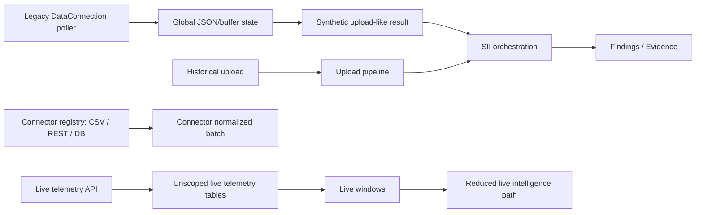
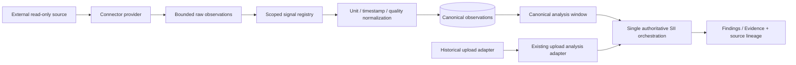

# Generic Telemetry Architecture Audit

> Campaign: `generic-telemetry-ingestion`
> Date: 2026-08-25
> Status: Phase 1 complete — read-only architecture audit
> Scope: backend, frontend, persistence, identity, ingestion, analysis, evidence, jobs, AWS, secrets, health, observability, tests, and Citadel gates

## Executive conclusion

Neraium already contains three partial telemetry paths:

1. A legacy `DataConnection` service that polls a REST endpoint, buffers records, synthesizes upload-like results, and drives a live baseline.
2. A newer live-telemetry mapping, ingestion, quality, windowing, and live-analysis path.
3. PostgreSQL normalization tables and a bulk writer used for dataframe-oriented normalization.

The production milestone must **converge these capabilities rather than add a fourth path**. The recommended architecture is to extend the newer live-telemetry concepts into tenant-scoped relational entities, retain the existing connector provider registry, replace unsafe transport/configuration boundaries, and extract a source-neutral canonical analysis-window adapter that calls the authoritative SII engine exactly once. Historical/manual upload remains supported as an independent input adapter.

The current paths are not production-safe for multiple tenants. Data connections and most telemetry records are globally keyed by `connection_id`, `system_id`, or `source`; connection credentials are accepted as ordinary request configuration; REST destinations are SSRF-capable; the database connector accepts browser-supplied DSNs and SQL; and recurring polling uses process-local locking. These are migration blockers, not incremental polish.

## Current architecture



The target migration keeps the useful components but removes global/vendor-shaped authority:



## Reusable components

### Authentication, tenant/workspace scope, and hierarchy

- Authentication establishes server-derived request context in `backend/app/core/security.py:58-90`; production session/service-token behavior is enforced in `backend/app/core/security.py:108-163`.
- Workspace membership and service-token allow-list checks exist in `backend/app/services/workspace_authorization.py:61-124`.
- `DatasetScope` provides a non-forgeable compound storage identity and immutable queue-envelope validation in `backend/app/services/dataset_scope.py:18-35` and `backend/app/services/dataset_scope.py:117-148`.
- Facility/system selection rejects ambiguous or missing server authority in `backend/app/services/facility_context.py:37-98`.
- The current Phase 4 work adds a stronger authenticated scope and server-bound system envelope in `backend/app/services/phase4_scope.py:80-319`. It is user-owned dirty work and must be integrated narrowly, not overwritten.
- Current physical hierarchy uses `equipment_id` in `backend/app/models/api_models.py:504-536`. The product-level `asset_id` should be a deliberate compatibility alias or canonical rename, not a second competing identity.

Limitations:

- Current tenant identity is effectively the authenticated subject plus workspace context; `backend/app/services/dataset_scope.py:71` documents this as temporary until organization membership exists.
- Facility context is a scoped JSON registry rather than a relational tenant/facility/system/asset model.
- Roles are global, while resource access is workspace-scoped. New telemetry routes must resolve the resource first and return opaque not-found for out-of-scope IDs before applying mutation-role checks.

### Connector framework

- `backend/app/connectors/base.py:9-39` defines a provider lifecycle skeleton.
- `backend/app/connectors/registry.py:20-39` centralizes provider registration.
- `backend/app/connectors/limits.py:6-24` supplies response, row, and normalization-expansion budgets.
- `backend/app/connectors/rest_connector.py:349-393` streams bounded JSON responses and returns sanitized network failures.
- `backend/app/connectors/database_connector.py:187-239` demonstrates parameter binding, PostgreSQL read-only transactions, statement timeouts, TLS modes, and row limits.

The provider contract must be extended, not scattered, to cover discovery, bounded historical backfill, incremental reads, optional streaming capability descriptors, health facets, retry/rate-limit results, and opaque checkpoints. It must never expose write/control/command primitives.

### Ingestion, mapping, quality, and windows

- `backend/app/services/live_telemetry.py:342-566` already implements transactional batch identity, per-signal partial rejection, duplicate handling, out-of-order handling, timestamp/numeric checks, and source-health updates.
- `backend/app/services/live_windows.py:20-173` already contains deterministic coverage, eligible-signal, duplicate, and quality-window logic.
- `backend/app/services/historical_ingestion.py:1521-2132` contains reusable immutable raw retention, timestamp/schema validation, deterministic canonical artifacts, and explicit unit-conversion provenance.
- `backend/app/water_intelligence/units.py:9-190` has tested physical dimensions and conversions for the required flow, pressure, temperature, power, percentage/fraction, and related units.
- `backend/db/migrations/create_normalization_tables.py:8-126` demonstrates PostgreSQL migration ledger, `TIMESTAMPTZ`, source-aware uniqueness, and time indexes; `backend/app/services/telemetry_normalization_writer.py:12-90` demonstrates batched upserts.

These algorithms need scoped relational storage and richer lineage. Current schemas omit tenant, facility, asset, connection, original unit/value, raw timestamp, mapping provenance, checkpoints, and evidence references.

### Upload, SII, findings, and evidence

- The active upload orchestration accepts already-normalized rows, columns, profiles, timestamp metadata, telemetry catalog, ingestion report, and authenticated scope in `backend/app/services/upload_pipeline.py:53-271`.
- The engine contract is source-agnostic at `backend/app/engine/sii_engine.py:51` and must remain the single authoritative SII call, consistent with `docs/ACTIVE_ANALYSIS_PATH.md:100`.
- `backend/app/services/analysis_result_contract.py:20-152` provides the UI compatibility envelope; its bounded normalized-telemetry projection is not a durable observation store.
- Evidence creation already records source rows, windows, timestamps, raw digest, canonical dataset, and transformations in `backend/app/services/upload_evidence.py:349`.
- Evidence writes and finding materialization are scoped in `backend/app/services/evidence_store.py:116`; evidence routes apply authenticated/operator boundaries in `backend/app/routers/evidence.py:17-70`.
- Behavioral models remain behind their existing repositories/contracts in `backend/app/services/behavioral_model_repository.py:19-147` and `backend/app/engine/sii/behavioral_model_contract.py:26`. Ingestion must not write these stores directly.

Recommended analysis seam:

```text
CanonicalAnalysisWindow
  tenant/workspace/facility/system/asset scope
  UTC rows keyed by canonical signal ID
  numeric profiles + telemetry signal catalog
  quality/coverage + connection/ingestion-run lineage
  server-attested Phase 4 scope
        |
        v
source-neutral run_analysis_window(...)
        |
        v
evaluate_sii(...) exactly once
```

The existing upload path remains an adapter to that seam. Connector telemetry must never be serialized back to CSV or assigned a synthetic upload identity.

### Jobs, locks, retries, and worker lifecycle

- `backend/app/entrypoint.py:148-245` already provides split API/worker process roles, graceful shutdown, structured summaries, and worker heartbeat publication.
- `backend/app/services/live_analysis.py:546-582` demonstrates durable conditional claims; `backend/app/services/live_analysis.py:1068-1121` demonstrates due-work selection with per-system failure isolation.
- Upload workers have strong immutable-scope recovery and idempotent completion patterns in `backend/app/services/upload_queue_lifecycle.py:167-648`.

Do not reuse the current recurring mechanisms unchanged:

- `backend/app/services/data_connection_poller.py:11-69` is an API-process daemon using only a Python lock; it cannot prevent overlap across replicas or survive restarts safely.
- The S3 upload queue claim is non-atomic and explicitly single-consumer per `docs/database-migrations.md:25`.
- API and worker use distinct EFS access points in `infra/staging/neraium-staging.yaml:428-468`, so role-local SQLite cannot coordinate production ingestion.

The first milestone should use shared PostgreSQL due-work claiming with transactional leases, persisted cursor/checkpoint, `next_attempt_at`, bounded exponential backoff, lease expiry/recovery, and one run record per attempt. SQS FIFO plus DLQ is a future throughput option, not required for the first vertical slice.

### Secrets and redaction

- `backend/app/services/auth_store.py:808-915` demonstrates lazy AWS Secrets Manager access, JSON validation, in-memory caching, sanitized diagnostics, and refresh after rotated credentials.
- `backend/app/core/logging_config.py:43-205` recursively redacts sensitive keys, URL credentials, auth headers, cookies, AWS keys, and exception material.

The production connection secret service should reuse those patterns while remaining a separate abstraction. Database rows and APIs must contain only an opaque secret identifier internally; client responses should expose only `credentials_configured` and safe update/version metadata—never secret content or ARN/reference.

Current IAM permits reads of deployment-created application/auth secrets, not dynamically created tenant connection secrets. Required least-privilege roles are documented under Infrastructure gaps below.

### Health and observability

- `/api/health` and `/api/ready` distinguish liveness/readiness and inspect runtime/auth/queue/startup dependencies in `backend/app/routers/health.py:116-208`.
- `backend/app/services/production_health.py:44-425` models persistent failures, worker heartbeat, queue age, Secrets Manager access, and credential refresh.
- `backend/app/main.py:289-348` emits structured request telemetry with correlation IDs.
- `scripts/configure-production-monitoring.sh:44-200` configures CloudWatch Container Insights, alarms, and log-derived metrics.

The connection health model must independently report reachability, authentication, telemetry arrival/freshness, mapping completeness, quality acceptability, checkpoint/worker state, and last healthy time. A one-time successful validation cannot equal `connected`.

## Current production blockers

### P0: tenant isolation

- Legacy `data_connections` is a global JSON row keyed only by connection ID: `backend/app/services/runtime_db.py:201-208` and `backend/app/services/runtime_db.py:2775-2829`.
- Live mappings, observations, rejections, health, and windows are keyed by system/source instead of authoritative tenant/workspace/facility scope: `backend/app/services/runtime_db.py:460-566`, `backend/app/services/live_telemetry.py:59-686`, and `backend/app/services/live_windows.py:42-70`.
- Data-connection and telemetry routes do not bind resource access to request scope: `backend/app/routers/data_connections.py:43-164` and `backend/app/routers/telemetry.py:43-157`.

Two tenants with the same natural system/source/tag/timestamp can currently collide. Every entity, deduplication key, read, mutation, run, error, health calculation, window, evidence link, and finding handoff must carry an authoritative server-derived scope.

### P0: legacy customer/domain assumptions

- `backend/app/services/data_connections.py:51-83` seeds a synthetic cultivation facility/room and a global default REST connection.
- External payload facility identity can override server configuration, and live results pivot by vendor `sensor_name` before synthesizing upload semantics.
- Frontend prototype `frontend/src/components/setup/TagMappingPanel.jsx:3-27` contains domain-specific required signals.

Production defaults and fixtures must be customer-agnostic. External payload identity is lineage, never authority.

### P0: SSRF and network egress

- `backend/app/contracts.py:51-60` validates only HTTP(S), a hostname, length, and absence of embedded credentials.
- `backend/app/connectors/rest_connector.py:349-367` and `backend/app/services/data_connections.py:886-894` request configured endpoints directly.
- Staging ECS tasks have broad public egress in `infra/staging/neraium-staging.yaml:231-264` and `infra/staging/neraium-staging.yaml:1056-1101`.

Required public-HTTPS policy:

- HTTPS only in production; port 443 initially.
- Reject userinfo, fragments, unsafe host syntax, localhost aliases, loopback, private, link-local, multicast, reserved, unspecified, and metadata ranges for IPv4 and IPv6.
- Resolve every A/AAAA answer and reject the entire destination if any answer is unsafe.
- Use `verify=True`, `follow_redirects=False`, `trust_env=False`, bounded connect/read/write/pool timeouts and pools, and a total page/byte/record/time budget.
- Revalidate every request/page at execution time; pagination may only derive same-origin bounded cursor/query changes and cannot follow arbitrary absolute `next` URLs.
- Application validation must be paired with controlled egress/proxy/firewall to fully mitigate DNS rebinding in production.
- Private customer sources require an explicit VPN/PrivateLink/site-agent/network-profile pattern. Do not weaken the generic public connector to reach RFC1918 destinations.

### P0: read-only connector boundary

- `backend/app/connectors/models.py:109-127` allows browser-selected `POST`, arbitrary headers, token, and body.
- `backend/app/connectors/models.py:131-140` allows plaintext database DSNs and arbitrary browser-supplied SQL.
- SQLite connector mode can open arbitrary existing host paths; PostgreSQL can target arbitrary network hosts.

The generic contract exposes retrieval only. Public HTTP is GET/HEAD-only. A provider-specific POST is permissible only as a server-owned adapter explicitly classified and reviewed as read-only; it is never a browser-controlled generic method/body. Block user-provided `Host`, auth, proxy, forwarding, hop-by-hop, and content-length headers. Construct authentication server-side from a secret reference.

The database/historian milestone is a safe provider boundary: no production SQLite, raw DSN, or raw SQL API. Store a secret reference, approved private-network profile, and server-owned query-template ID; accept only bounded typed time/cursor parameters. Preserve transaction read-only, statement timeout, TLS `verify-full`, parameter binding, and row caps as defense in depth.

### P0: durable shared persistence and scheduling

`docs/database-migrations.md:21-25` explicitly classifies runtime SQLite as single-tenant and the S3 queue as single-consumer. Production connections, mappings, observations, checkpoints, and ingestion leases therefore require shared PostgreSQL. The API-thread poller must not be the recurring scheduler.

### P0: secret lifecycle

Current connector request/config models accept plaintext credentials, while connector health persists masked configuration. Production persistence must never contain those values. Until dynamic Secrets Manager IAM is deployed, the secure abstraction may support only pre-provisioned references; it must fail closed instead of falling back to plaintext storage.

## Frontend audit

### Current surfaces

- `/workspace/data-sources` maps to `DataConnectionsWorkspace`, but that component currently orchestrates historical/manual ingestion only: `frontend/src/AuthenticatedApp.jsx:31-40`, `frontend/src/components/AppWorkspaceRouter.jsx:187-230`, and `frontend/src/components/DataConnectionsWorkspace.jsx:2196-2259`.
- The only real connector UI is an admin `ConnectorSetupPanel` wired to connector-type test/ingest routes. It accepts direct endpoint/token/database URL/query configuration and stores endpoint/sample/query in session storage: `frontend/src/components/GovernanceAdminWorkspace.jsx:74-101` and `frontend/src/components/ConnectorSetupPanel.jsx:5-101`.
- `HistorianSetupWorkspace` is an orphaned local-state prototype and fakes validation; `TagMappingPanel` is static/domain-specific.
- E2E intentionally asserts the connector panel is in Administration rather than Data Connections: `frontend/tests/e2e/auth-navigation-connectors.spec.js:111-125`.

### Reuse and target integration

- Keep `/workspace/data-sources`; add real telemetry connection management inside `DataConnectionsWorkspace` while preserving the existing historical import flow as a clearly separate section.
- Pass current workspace/facility context through `AppWorkspaceRouter`; use the shared `apiFetch`, which includes cookies and `X-Neraium-Workspace-Id` in `frontend/src/config.js:267-280`.
- Follow bounded-error, abort, partial-state, and shape-validation patterns in `frontend/src/services/api/liveMonitoringApi.js:24-166`.
- Reuse shared `Panel`, `Button`, `EmptyState`, accessible modal focus/Escape patterns, existing connector card styling, and responsive action layouts.
- Replace the legacy Administration mutation panel after parity; do not retain two production mutation paths.
- Key connection state by scope, cancel requests and clear selected/wizard state on scope changes, and render server-returned capabilities rather than treating frontend role hiding as authorization.

Required UI flow:

1. Source type.
2. Safe connection details.
3. One-way secure credentials submission.
4. Server validation.
5. Signal discovery.
6. Explicit mapping and unit review.
7. Review.
8. Enable ingestion.

The registry UI must support unmapped signals, pagination/filtering, explicit conversion confirmation, stale/problem views, and no secret/ref rendering.

## Canonical production entities to formalize

The architecture phase should evaluate and specify at least:

- `data_connections`
- `connection_secret_references` or an internal secret reference field with response exclusion
- `external_signals`
- `canonical_signal_concepts`
- `signal_mappings`
- `ingestion_runs`
- `connection_checkpoints`
- `normalized_observations`
- `ingestion_rejections` / quarantine
- `connection_health`
- `connection_audit_events`
- `analysis_runs` / analysis-window lineage references

Every child must enforce authoritative scope through foreign keys or compound keys. Observation uniqueness must include scope, connection/source lineage, external/canonical signal identity, and normalized timestamp. Access indexes should begin with tenant/workspace scope, then facility/system/asset or connection, then timestamp.

Raw source tag, source timestamp, source timezone/offset, original unit/value, mapping provenance, conversion formula/version, connection, ingestion run, and observation identity must survive through analysis/evidence lineage.

## Migration requirements

- Use additive, backward-compatible migrations and the repository migration ledger pattern.
- Do not coerce existing global telemetry rows into a tenant. Ambiguous legacy rows remain quarantined/legacy-only and analysis-ineligible.
- Keep legacy data-connection routes as compatibility adapters only while the production UI migrates; remove global reset behavior from production paths.
- Preserve manual upload routes, baseline workflows, retry/replay, evidence completion, and current SII call cardinality.
- Prefer new focused telemetry modules and narrow edits to dirty shared files (`security.py`, `api_models.py`, `runtime_db.py`, `data.py`, facility/dataset scope, upload/SII modules).

## Infrastructure gaps

Milestone-one deployment needs:

1. Shared PostgreSQL application/domain storage accessible by API and worker, using least-privilege roles separate from RDS master/auth credentials.
2. Worker-owned transactional due-connection leases; no additional queue is required for the first milestone.
3. Separate API and worker IAM task roles.
4. Secrets Manager namespace such as `neraium/{environment}/telemetry-connections/*`.
5. API permission for tightly scoped create/update/tag/describe (and get only if API validates); worker get/describe only. No `ListSecrets`, wildcard resource, or normal lifecycle delete.
6. Telemetry ingestion CloudWatch filters, alarms, dashboard widgets, and worker health fields.
7. Strict application SSRF controls immediately; controlled egress as the production hardening requirement.

No infrastructure should be deployed by this campaign.

## Existing tests and baseline

Reusable tests cover connector normalization and transport bounds, database read-only controls, live mapping/ingestion/duplicates/future/late/stale states, migrations, workspace isolation, authenticated Phase 4 scope, historical unit provenance, evidence, replay, and SII unification.

The audit ran this focused backend baseline on the current dirty tree:

```text
136 passed, 4 deselected, 8 warnings in 94.95s
```

Command:

```bash
PYTHONPATH=backend ./.venv/bin/pytest -q \
  tests/test_connectors.py \
  tests/test_connector_sonar_refactors.py \
  tests/test_connector_store_security.py \
  tests/test_connector_performance_limits.py \
  tests/test_data_connections.py \
  tests/test_data_connections_polling.py \
  tests/test_live_telemetry_ingestion.py \
  tests/test_telemetry_normalization.py \
  tests/test_schema_migrations.py \
  tests/test_phase2_auth.py \
  tests/test_dataset_state_scoping.py \
  tests/test_workspace_authorization.py
```

The four deselections are slow tests excluded by `pytest.ini`. Historical review packages record three pre-existing default-backend failures and existing performance/mobile gaps; those must be independently reproduced before being classified as pre-existing in final verification.

Repository gates:

- Root `./scripts/validate_repo.sh` runs backend pytest, frontend lint/unit/build, and Chromium smoke but is not sufficient alone.
- CI adds PostgreSQL integration, Docker non-root startup/health/readiness, and dependency audits in `.github/workflows/ci.yml`.
- Frontend requires `npm run setup:codex` before browser tests in a fresh Codex environment.
- Vitest currently includes only `src/**/*.test.js`; `.test.jsx` prototypes are not default coverage.

## Mandatory new verification

### Authorization and secrets

- Tenant A and B use identical facility/system/source/tag/timestamp values without collision through connection, registry, observations, runs, errors, analysis, evidence, and findings.
- All list/detail/mutation/validate/discover/map/enable/disable/backfill/retry paths enforce opaque server-side scope.
- Service-token workspace allow-list is enforced.
- Secret values and references never appear in database configuration JSON, responses, logs, audit details, health, errors, or tracebacks.

### Connector and SSRF

- Valid response, auth failure, timeout, malformed payload, 429/`Retry-After`, transient retry, pagination/cursor, retry exhaustion, and checkpoint advancement.
- HTTP/non-443, localhost, IPv4/IPv6 private/link-local/reserved/metadata, mixed DNS answers, DNS rebinding, redirect and pagination-origin bypass, environment proxy use, and forbidden headers/methods are rejected.
- Page, byte, record, expansion, and total-time budgets are enforced.
- Database route rejects raw DSN/SQL/SQLite paths; server template parameters remain read-only and bounded.

### Normalization and ingestion

- F/C, psi/kPa, GPM/L/s, kW/W, percent/fraction conversions, incompatible/unknown units, precision, identity, original preservation, conversion version, and explicit provenance.
- Offset preservation, UTC normalization, facility timezone, DST fold/gap, naive/invalid/future timestamps, exact duplicates, and out-of-order policy.
- Partial batch failures, idempotency across restart, durable checkpoint ordering, lease overlap/recovery, bounded backoff, retry-storm cap, quarantine, resumable backfill, stale state, and structured metrics.
- Unmapped signals persist as mapping-required and never reach analysis.

### Analysis and historical regression

- Connector windows use canonical signal IDs, call `evaluate_sii` once, and never call upload-byte/CSV parsing.
- Manual upload, create/extend baseline, retry, replay, historical review, evidence export, and behavioral-model paths remain unchanged.
- Observation-to-finding lineage retains connection, run, registry, external tag, raw/normalized timestamps and units, conversion, and observation IDs.

### UI and QA

- Create, credential submit, validate, discover, map, review, enable, health, stale/degraded, error, retry, and authorization denial.
- Scope switch clears stale data and aborts in-flight requests.
- Desktop and 390px browser flows, keyboard/focus/Escape behavior, accessibility, no overflow, and screenshot evidence.

## Decisions required by the architecture gate

1. Adopt shared PostgreSQL for production connection/canonical telemetry state; do not expand role-local SQLite as multi-tenant authority.
2. Define `asset_id` compatibility with current `equipment_id`.
3. Define the server-derived scope key and fail-closed handling of global legacy rows.
4. Define one-way secret creation/update and IAM ownership validation.
5. Define server-owned historian query templates and approved private-network profiles.
6. Define transactional worker leases/checkpoints and bounded retry/backfill semantics.
7. Define a central public-HTTPS SSRF policy plus controlled-egress deployment requirement.
8. Define the source-neutral canonical analysis-window/evidence-lineage contract.

## Phase 1 verdict

The repository contains substantial reusable ingestion, normalization, analysis, evidence, worker, health, and UI foundations, but the production vertical slice must replace global identity, unsafe configuration, and process-local scheduling boundaries. Major implementation should not begin until the feature PRD and architecture record the eight decisions above with migration, authorization, and verification gates.
