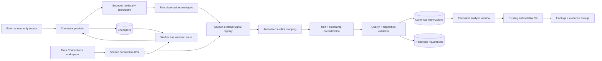

# Architecture: Generic Telemetry Connection and Ingestion

> PRD: `.planning/prd-generic-telemetry-ingestion.md`
> Audit: `.planning/research/generic-telemetry-architecture-audit.md`
> Date: 2026-08-25
> Mode: feature
> Status: approved — implementation authorized 2026-08-25

## Architecture outcome

Neraium will converge its existing connector, live-telemetry, historical-normalization, worker, health, evidence, and SII paths around one tenant-scoped canonical telemetry domain stored in shared PostgreSQL. The existing connector registry remains the provider boundary, but the production contract becomes retrieval-only and capability-driven; the first enabled provider is a hardened public HTTPS GET adapter. Signals remain registered but analysis-ineligible until an authorized mapping resolves hierarchy, canonical concept, unit policy, and provenance. Worker-owned PostgreSQL leases run incremental ingestion and bounded backfill through the same idempotent normalization pipeline. Eligible canonical observations are projected into source-neutral analysis windows and handed to the existing SII orchestration exactly once, while the historical upload adapter remains functional and separate.

## System flow



## File tree

Feature-mode inventory: only planned new (`+`) and modified (`~`) files are listed. Implementation should prefer these focused modules over broad rewrites of currently dirty shared files.

```text
backend/
├── app/
│   ├── connectors/
│   │   ├── base.py                                      ~ retrieval-only capability contract
│   │   ├── models.py                                    ~ provider/raw/checkpoint contracts; remove production plaintext credentials
│   │   ├── registry.py                                  ~ production provider descriptors
│   │   ├── limits.py                                    ~ page/total request budgets
│   │   ├── rest_connector.py                            ~ compatibility wrapper over hardened provider
│   │   ├── https_telemetry.py                           + generic HTTPS GET provider
│   │   └── historian_provider.py                        + server-template boundary; disabled until configured
│   ├── core/
│   │   ├── config.py                                    ~ telemetry DB, secret, cadence, egress settings
│   │   └── security.py                                  ~ narrow request-scope helper integration only
│   ├── models/
│   │   └── telemetry_api_models.py                      + isolated request/response contracts
│   ├── routers/
│   │   ├── data_connections.py                          ~ scoped production lifecycle APIs + legacy adapters
│   │   ├── telemetry.py                                 ~ scoped registry/observation compatibility
│   │   ├── health.py                                    ~ ingestion worker readiness summary
│   │   └── observability.py                             ~ sanitized ingestion metrics
│   ├── services/
│   │   ├── telemetry_domain.py                          + enums/entities/capabilities/status transitions
│   │   ├── telemetry_scope.py                           + server-derived scope + resource authorization
│   │   ├── telemetry_repository.py                      + PostgreSQL repositories and leases
│   │   ├── telemetry_secrets.py                         + opaque Secrets Manager abstraction
│   │   ├── telemetry_egress.py                          + URL/DNS/IP/port/header/pagination policy
│   │   ├── telemetry_units.py                           + explicit dimensioned conversions + provenance
│   │   ├── telemetry_timestamps.py                      + raw/local/UTC/DST normalization
│   │   ├── signal_registry.py                           + discovery, registry, mapping, validation
│   │   ├── telemetry_ingestion.py                       + reusable batch normalization/persistence
│   │   ├── telemetry_scheduler.py                       + due-work leases, backoff, retry, checkpoints
│   │   ├── telemetry_backfill.py                        + bounded resumable source backfill
│   │   ├── telemetry_health.py                          + multidimensional connection/signal health
│   │   ├── telemetry_lineage.py                         + observation/window/evidence lineage
│   │   ├── telemetry_analysis_window.py                 + canonical source-neutral SII projection
│   │   ├── live_telemetry.py                            ~ compatibility adapter to canonical ingestion
│   │   ├── live_windows.py                              ~ scoped canonical query delegation
│   │   ├── live_analysis.py                             ~ authoritative analysis-window delegation
│   │   ├── data_connections.py                          ~ legacy route adapter; remove production authority
│   │   ├── production_health.py                         ~ ingestion dependency observations
│   │   ├── upload_pipeline.py                           ~ extract shared analysis-window call seam
│   │   └── upload_evidence.py                           ~ accept source-neutral lineage references
│   ├── entrypoint.py                                    ~ worker ingestion tick + graceful shutdown
│   └── main.py                                          ~ startup wiring; disable legacy API poller in production
├── db/
│   └── migrations/
│       └── create_telemetry_connection_tables.py        + additive PostgreSQL migration + verifier
└── requirements.txt                                     ~ unchanged unless an approved dependency is necessary

frontend/
├── src/
│   ├── components/
│   │   ├── DataConnectionsWorkspace.jsx                 ~ compose telemetry connections + extracted historical import
│   │   ├── HistoricalImportWorkspace.jsx                + stable wrapper for existing upload/baseline state
│   │   └── dataConnections/
│   │       ├── DataConnectionsManager.jsx               + scoped list/cards/actions
│   │       ├── ConnectionSetupWizard.jsx                + accessible eight-step wizard
│   │       ├── ConnectionHealthPanel.jsx                + health facets/freshness/counts
│   │       ├── SignalRegistryTable.jsx                  + paginated discovery/mapping table
│   │       ├── SignalMappingEditor.jsx                  + explicit hierarchy/unit conversion approval
│   │       ├── IngestionRunsPanel.jsx                   + runs, progress, retry, sanitized errors
│   │       └── BackfillPanel.jsx                        + bounded date/progress/resume controls
│   ├── services/
│   │   └── api/
│   │       └── dataConnectionsApi.js                    + response validation, abort, redacted errors
│   ├── styles/
│   │   ├── data-connections.css                         + focused responsive styles
│   │   └── index.css                                    ~ import focused styles
│   └── components/
│       └── AppWorkspaceRouter.jsx                       ~ pass workspace/session/capabilities
├── tests/
│   └── e2e/
│       └── data-connections.spec.js                     + desktop/mobile/authorization workflow
└── vitest.config.js                                     ~ include `.test.jsx` coverage

infra/
└── staging/
    └── neraium-staging.yaml                             ~ telemetry DB/env, separate roles, scoped secret IAM, monitoring

scripts/
├── bootstrap-production-aws.sh                          ~ least-privilege telemetry DB/secret role inputs
└── configure-production-monitoring.sh                   ~ ingestion alarms/dashboard metrics

docs/
├── TELEMETRY_ARCHITECTURE.md                            + canonical model and end-to-end flow
├── TELEMETRY_CONNECTOR_DEVELOPMENT.md                   + provider contract and local testing
├── TELEMETRY_OPERATIONS.md                              + health, backfill, retention, runbooks
├── TELEMETRY_SECURITY.md                                + read-only/SSRF/secrets/private-network boundary
├── TELEMETRY_DEPLOYMENT.md                              + DB/IAM/egress/migration/deployment steps
└── ACTIVE_ANALYSIS_PATH.md                              ~ document canonical window adapter

tests/
├── test_telemetry_entities.py                           + entity/state/serialization invariants
├── test_telemetry_migrations.py                         + fresh/upgrade/idempotent/rollback verification
├── test_telemetry_authorization.py                      + full A/B tenant route matrix
├── test_telemetry_secrets.py                            + one-way/reference/redaction/rotation tests
├── test_telemetry_units.py                              + required conversions and incompatibility
├── test_telemetry_timestamps.py                         + UTC/offset/DST/future/duplicate/late tests
├── test_telemetry_connector_contract.py                 + provider capabilities and no-write contract
├── test_https_telemetry_connector.py                    + fetch/pagination/retry/rate-limit/budgets
├── test_telemetry_ssrf.py                               + network-policy adversarial matrix
├── test_historian_provider_boundary.py                  + no SQL/DSN/path; template parameters only
├── test_signal_registry.py                              + discovery/unmapped/freshness registry behavior
├── test_signal_mapping.py                               + hierarchy/unit/provenance/duplicate validation
├── test_telemetry_ingestion.py                          + idempotency/partial failure/quarantine/checkpoint
├── test_telemetry_scheduler.py                          + leases/recovery/backoff/non-overlap
├── test_telemetry_backfill.py                           + bounded/resumable/idempotent backfill
├── test_telemetry_health.py                             + reachability/auth/freshness/mapping/quality facets
├── test_telemetry_analysis_handoff.py                   + canonical window + one SII call
├── test_telemetry_lineage.py                            + finding-to-observation-to-source trace
└── test_telemetry_infrastructure_contract.py            + IAM/env/monitoring least-privilege assertions
```

## Component breakdown

### Scoped telemetry domain and repository

- **Files:** `telemetry_domain.py`, `telemetry_scope.py`, `telemetry_repository.py`, PostgreSQL migration.
- **Dependencies:** authenticated `WorkspaceContext`, `DatasetScope`, facility/system authority, psycopg.
- **Complexity:** high.
- **Responsibility:** define stable entity/status/quality contracts, derive scope only from server context, provide compound-scope repositories, enforce leases and indexes, and make out-of-scope resources indistinguishable from absent resources.

### Connector providers and secure transport

- **Files:** connector base/models/registry/limits, `https_telemetry.py`, `historian_provider.py`, `telemetry_egress.py`.
- **Dependencies:** HTTP client, DNS/socket/IP standard library, secret resolver, repository checkpoint.
- **Complexity:** high.
- **Responsibility:** expose retrieval capabilities only; validate/discover/fetch/backfill/health; enforce per-request and whole-run budgets; sanitize every failure; never accept browser-controlled method/body/headers/SQL/DSN/path.

### Secrets

- **Files:** `telemetry_secrets.py`, config, IAM templates/tests.
- **Dependencies:** AWS Secrets Manager client pattern from `auth_store`, scoped request resource.
- **Complexity:** high/security-sensitive.
- **Responsibility:** one-way create/update, pre-provisioned-reference binding, server-only resolution, cache/rotation, ownership validation, and API/log/audit redaction. The internal reference is excluded from every public model.

### Signal registry, mapping, units, and time

- **Files:** `signal_registry.py`, `telemetry_units.py`, `telemetry_timestamps.py`.
- **Dependencies:** facility/system/asset authority, tested unit definitions, IANA `zoneinfo`.
- **Complexity:** high.
- **Responsibility:** persist all discovered signals as unmapped; validate explicit mappings and dimensions; record actor/provenance/conversion; preserve raw units/timestamps; normalize only supported confirmed conversions; quarantine ambiguous/invalid inputs.

### Ingestion, leases, backfill, and health

- **Files:** ingestion/scheduler/backfill/health services and entrypoint.
- **Dependencies:** provider contract, repository, normalizers, structured logging, worker heartbeat.
- **Complexity:** high.
- **Responsibility:** claim a connection, fetch bounded pages, process each observation independently, persist accepted/rejected outcomes atomically by page/batch, advance checkpoints only after durable writes, recover expired leases, cap retry storms, and calculate independent health facets.

### Analysis and lineage

- **Files:** `telemetry_analysis_window.py`, `telemetry_lineage.py`, narrow upload/SII/evidence adaptations.
- **Dependencies:** canonical observation repository, existing `evaluate_sii`, analysis result/evidence contracts.
- **Complexity:** high.
- **Responsibility:** select eligible mapped signals with sufficient quality/coverage, pivot by canonical signal ID, retain observation identities, call the existing SII path once, and persist evidence references back to connection/run/tag/observation lineage.

### Data Connections experience

- **Files:** API client, manager, wizard, registry/mapping, health, runs/backfill components, focused styles/tests.
- **Dependencies:** shared `apiFetch`, workspace scope key, server-returned capabilities, accessible modal primitives.
- **Complexity:** high.
- **Responsibility:** manage the restrained lifecycle without holding secrets after submission, clear state on facility switch, surface health distinctions, and keep historical import available as a separate workflow.

## Data model

All operational entities are stored in a dedicated PostgreSQL schema (proposed: `telemetry`) with UUID primary keys, UTC database timestamps, and server-derived `tenant_scope_id`, `workspace_id`, and `resource_scope_id`. Production connection creation is permitted only in an active explicit facility workspace for which `authenticated_phase4_scope_from_request_context(...)` returns an `AuthenticatedPhase4Scope`. Its deterministic `resource_scope_id` is the durable tenancy/resource key shared by every authorized operator and worker; the current `user_id` and user-dependent `DatasetScope.storage_id` are never connection/lease/deduplication authority. Personal-default and legacy free-form workspaces may continue upload compatibility but cannot create production connections. Foreign keys use internal UUIDs; natural external identifiers are lineage fields, never scope authority.

### `data_connections`

- `id UUID PK`
- `tenant_scope_id TEXT NOT NULL`, `workspace_id TEXT NOT NULL`, `resource_scope_id TEXT NOT NULL`
- `facility_id TEXT NOT NULL`, `name TEXT NOT NULL`, `connector_type TEXT NOT NULL`
- `lifecycle_status TEXT NOT NULL` (`draft`, `validating`, `connected`, `degraded`, `disconnected`, `disabled`, `error`, `archived`)
- `enabled BOOLEAN NOT NULL DEFAULT FALSE`
- `safe_config JSONB NOT NULL` containing only schema-approved non-secret fields
- `secret_binding_id UUID NULL` to server-only secret binding
- `timezone TEXT NOT NULL`, `polling_interval_seconds INTEGER NOT NULL`
- `next_attempt_at`, `last_attempt_at`, `last_success_at`, `last_healthy_at`, `last_telemetry_at` as `TIMESTAMPTZ`
- `last_error_code TEXT NULL`, `last_error_summary TEXT NULL` (sanitized and bounded)
- `lease_owner TEXT NULL`, `lease_expires_at TIMESTAMPTZ NULL`
- `created_by`, `updated_by`, `created_at`, `updated_at`, `archived_at`
- Unique `(resource_scope_id, id)` and `(resource_scope_id, facility_id, lower(name)) WHERE archived_at IS NULL`.
- Indexes `(resource_scope_id, facility_id, updated_at DESC)`, `(enabled, next_attempt_at) WHERE archived_at IS NULL`, `(lease_expires_at) WHERE lease_owner IS NOT NULL`.

### `connection_secret_bindings`

- `id UUID PK`, scoped connection FK, `provider TEXT`, `internal_reference TEXT`, `version_marker TEXT`, `updated_at`.
- `internal_reference` is server-only, never selected by public repository projections, logged, audited, or serialized.
- Unique connection binding; ownership/prefix/tags are revalidated before resolution.
- Secret values never enter PostgreSQL.

### `canonical_signal_concepts`

- Global, versioned Neraium taxonomy: `id`, stable `canonical_name`, `display_name`, physical `dimension`, `canonical_unit`, description, version, active flag.
- No vendor aliases become approved mappings automatically.

### `external_signals`

- Scoped `id`, `connection_id`, `external_tag_id`, `external_tag_name`, display label, discovered source unit/cadence, source metadata, enabled, mapping status, last observed UTC, quality summary, created/updated timestamps.
- Unique `(resource_scope_id, connection_id, external_tag_id)`.
- Index `(resource_scope_id, connection_id, mapping_status, updated_at DESC)`.

### `signal_mappings`

- Scoped `id`, external signal FK, facility/system/asset IDs, canonical concept FK/name, source unit, canonical unit, conversion ID/version, expected cadence, source timezone, enabled, provenance (`manual`, actor, timestamp, reason), revision.
- `asset_id` is canonical; one compatibility function resolves existing `equipment_id` to the same server-owned identity.
- Only one enabled mapping per external signal. Duplicate canonical mappings within the same connection/hierarchy require an explicit merge policy and otherwise fail.
- Incompatible/unknown units cannot produce an enabled mapping.

### `ingestion_runs`

- Scoped `id`, connection ID, mode (`validation`, `discovery`, `incremental`, `backfill`, `retry`), status, lease token, bounded range, start/finish timestamps, attempt/retry counts, pages, received/accepted/rejected/duplicate/out-of-order counts, latency, checkpoint-before/after digest, sanitized error code/summary, actor or worker identity.
- Index `(resource_scope_id, connection_id, started_at DESC)` and `(status, started_at)`.

### `connection_checkpoints`

- Scoped connection/mode PK, opaque provider cursor JSON with schema/size limits, high-water UTC timestamp, revision, updated run ID/time.
- Compare-and-swap revision; advances only in the same transaction that durably records the accepted page.

### `normalized_observations`

- Scoped `id`, connection/run/external-signal/mapping/concept FKs, facility/system/asset IDs.
- `external_tag_id`, optional provider event ID, raw source timestamp string, source timezone/offset, `observed_at_utc TIMESTAMPTZ`, `ingested_at TIMESTAMPTZ`.
- Original numeric value/unit and normalized numeric value/canonical unit.
- Conversion ID/version and mapping revision/provenance snapshot.
- `quality_state`, `ingestion_disposition`, `analysis_eligible`, bounded metadata, source-record digest.
- Unique idempotency key `(resource_scope_id, connection_id, external_signal_id, observed_at_utc, source_record_digest)`; a provider event ID may supply a stricter partial unique key.
- Indexes `(resource_scope_id, facility_id, system_id, asset_id, observed_at_utc DESC)`, `(resource_scope_id, connection_id, observed_at_utc DESC)`, `(resource_scope_id, canonical_concept_id, observed_at_utc DESC)`, and a BRIN time index after measured volume justifies it.

### `ingestion_rejections`

- Scoped run/connection/signal lineage, raw tag and timestamp/unit/value projections only as necessary, disposition/reason code, bounded sanitized detail, source digest, first/last seen, occurrence count.
- No credentials, request headers, full payloads, or URLs with queries.
- Duplicate and malformed items can be inspected without contaminating canonical observations.

### `connection_health`

- One scoped materialized record per connection with independent `reachability`, `authentication`, `telemetry_freshness`, `mapping_completeness`, `data_quality`, and `worker_checkpoint` facets; each has status, observed time, and safe reason code.
- Aggregate display state is computed by a deterministic precedence table; successful validation alone cannot yield `connected`.

### `telemetry_audit_events`

- Scoped connection/facility, actor, action, timestamp, safe before/after digests and bounded non-secret detail.
- Records lifecycle, credential binding/version change, mapping change, validation result, enable/disable, and backfill start/completion/failure—not observations.

### `telemetry_analysis_windows` and `telemetry_analysis_observations`

- Scoped window/run identity, facility/system/asset, UTC range, canonical concept set, coverage/quality summary, SII analysis run/evidence IDs.
- Join table records exact observation IDs used. Evidence can trace window → observations → external signals → connection.

## Canonical observation contract

```text
CanonicalTelemetryObservation
  scope:
    tenant_scope_id, workspace_id, resource_scope_id
    facility_id, system_id, asset_id?
  identity:
    observation_id, connection_id, ingestion_run_id
    external_signal_id, external_tag_id, canonical_signal_id/name
  time:
    source_timestamp_raw, source_timezone, source_offset
    observed_at_utc, ingested_at_utc
  measurement:
    original_value, original_unit
    normalized_value, canonical_unit
    conversion_id, conversion_version
  quality:
    quality_state, ingestion_disposition, analysis_eligible, reason_codes
  provenance:
    mapping_id, mapping_revision, mapping_actor, mapping_timestamp
    source_record_digest, bounded source metadata
```

No analysis component receives provider configuration or vendor field names as authority. Original tags remain available through lineage.

## Quality, disposition, and analysis eligibility

Keep these concepts separate:

- **Quality state:** `good`, `stale`, `missing`, `invalid_value`, `unit_unresolved`, `timestamp_invalid`, `mapping_required`, `format_invalid`.
- **Ingestion disposition:** `accepted`, `duplicate`, `out_of_order_accepted`, `quarantined`, `rejected`.
- **Analysis eligibility:** boolean plus deterministic reason codes based on mapping approval, supported unit/time normalization, quality, freshness, and window coverage.

An unusual but valid sensor value can remain `good` and analysis-eligible. An out-of-order observation can be accepted and queryable while marked by disposition. Duplicates and malformed values remain traceable through run/rejection records without entering SII.

## Unit normalization

- Define physical dimensions and canonical units by extending/reusing `water_intelligence.units`, not a new conflicting vocabulary.
- Mapping approval records source unit, target unit, conversion function ID/version, actor, and timestamp.
- Required v1 conversions: °F↔°C, psi↔kPa, GPM↔L/s, kW↔W, percent↔fraction, plus identity conversions.
- Preserve original value/unit on every observation.
- Unknown or incompatible units yield `unit_unresolved` and analysis ineligibility.
- Tag-name inference may produce a future suggestion only; it cannot enable a mapping or conversion.

## Timestamp normalization

- Preserve the exact source timestamp string and any supplied offset/timezone.
- Aware timestamps normalize to UTC without stripping source context.
- Naive timestamps require an explicitly approved mapping/connection IANA timezone.
- V1 rejects ambiguous DST folds and nonexistent DST-gap local times unless the source supplies an offset/fold discriminator; it never guesses.
- Reject invalid values and obvious future instants beyond a configured tolerance.
- Accept valid out-of-order history with a distinct disposition; exact idempotency duplicates do not create a second observation.
- UI formats facility local time but retains the exact source/UTC technical value for lineage views.

## Connector contract

```text
TelemetryConnector (retrieval only)
  descriptor() -> capabilities
  validate(context, secret_resolver) -> validation result
  discover_signals(context, checkpoint?, limits) -> discovery page
  fetch_incremental(context, checkpoint?, limits) -> raw page
  fetch_backfill(context, bounded_range, checkpoint?, limits) -> raw page
  health(context) -> transport/auth/provider facets
  read_events(...) -> optional read-only async iterator capability (future)
```

Capabilities declare discovery, incremental polling, bounded backfill, and optional read-only event streaming. There are no methods for write, command, acknowledge, publish, setpoint, mutation SQL, or control.

Provider output is a bounded `RawObservationEnvelope` containing external tag ID/name, raw timestamp, raw value, reported unit/quality, optional provider event ID, and bounded metadata. It cannot select tenant/facility/system/asset authority.

### Generic public HTTPS provider

Safe configuration contains:

- HTTPS origin and relative request path.
- Fixed GET method.
- Authentication scheme selector linked to a secret binding; no user auth headers.
- Approved query parameter names and bounded static values.
- JSON field paths for records, timestamp, value, external tag, unit, and optional quality/event ID.
- Same-origin cursor response path and request parameter name.
- Page size/cadence/time-range parameter names within a server schema.
- Timeout/page/record/byte budgets bounded again by server constants.

The provider sets TLS verification, disables redirects and environment proxy inheritance, validates URL/DNS/IP/port at validation and each request, rejects every unsafe DNS answer, and refuses off-origin cursor/navigation. Retry applies only to idempotent reads on connect/read timeouts and 408/429/500/502/503/504, honors bounded `Retry-After`, uses capped exponential full jitter, and never retries 400/401/403 or permanent configuration errors.

Application checks reduce risk but cannot completely close DNS rebinding races; production enablement therefore requires controlled outbound egress that independently resolves/enforces allowed public destinations.

### Historian/database provider boundary

V1 defines and tests the provider interface but does not expose raw database connectivity configuration. A production instance requires:

- Server-owned provider/query-template ID.
- Opaque secret binding.
- Approved private network-profile ID.
- Typed bounded time/cursor/facility parameters only.
- Dedicated read-only DB role, schema/table allow-list, transaction read-only, TLS `verify-full`, statement timeout, row cap, and parameter binding.

SQLite paths, raw DSNs, raw SQL, browser-defined queries, catalog access, side-effect functions, `COPY`, multi-statements, and mutations are rejected.

## Secrets lifecycle

1. The browser submits credential material only to a dedicated create/update action over authenticated TLS.
2. The API authorizes the scoped connection before consuming the body.
3. `TelemetrySecretStore` writes to AWS Secrets Manager (or a test-only fake) and returns an internal binding.
4. Only the internal binding is stored. The request object is not logged or retained.
5. Public responses expose `credentials_configured`, safe version/update time, and capabilities only.
6. Workers resolve the binding server-side, cache briefly, retry once after auth failure with a forced refresh, and redact every exception.
7. Archive does not delete secrets. Deletion is a separate privileged retention process with a recovery window.

Until dynamic IAM is deployed, production accepts only server-preprovisioned bindings selected through an internal operations path; plaintext fallback is prohibited. The implementation and IaC can support dynamic one-way writes, but enabling them is a deployment gate.

## Scheduling, checkpoint, retry, and backfill

- Worker queries enabled connections with `next_attempt_at <= now()` and no live lease.
- It claims one using `SELECT ... FOR UPDATE SKIP LOCKED`, writes a random lease token/owner/expiry, and creates an ingestion run.
- Every mutating repository call requires scope plus the current lease token.
- Each fetched page is normalized and persisted with partial per-record outcomes. The checkpoint compare-and-swap occurs only after the accepted/rejected page transaction commits.
- Success clears retry count, calculates next cadence, updates health, and releases the lease.
- Transient failure records a sanitized code, schedules capped jittered backoff, and releases the lease. Permanent auth/config/mapping errors do not storm retries.
- Expired leases are recoverable; idempotency keys make replay safe after uncertain worker termination.
- Disable prevents new claims and allows the current bounded request/page to finish before lease release.
- Backfill requires explicit UTC bounds, provider capability, maximum span, progress, separate checkpoint, and the same ingestion code path. It never invokes the upload UI/pipeline.

PostgreSQL leases are sufficient for the first deployment. SQS FIFO/DLQ becomes an option only if measured throughput or isolation requires it.

## Analysis authority, handoff, and lineage

Connection creation persists only a server-attested `tenant_scope_id`, `workspace_id`, and `resource_scope_id` produced by `AuthenticatedPhase4Scope`; mapping approval persists a validated `ServerBoundSystemIdentity` snapshot/digest produced from the current facility-context authority. Before an analysis run, `telemetry_scope.resolve_analysis_authority(...)` reconstructs `AuthenticatedPhase4Scope`, verifies its deterministic `resource_scope_id`, reloads the facility/system authority, and validates that the stored system identity and authority-record digest still match. Missing, stale, mismatched, personal/free-form, or client-derived authority makes the window ineligible; the worker never invents a system ID from tags or source payloads.

`telemetry_analysis_window.py` queries by validated `resource_scope_id`, hierarchy, UTC range, enabled mappings, eligible qualities, and minimum coverage. It pivots by canonical signal ID, not vendor tag, and constructs this exact source-neutral contract:

```text
CanonicalAnalysisWindow
  window_id, source_kind, source_run_id
  phase4_scope: AuthenticatedPhase4Scope
  phase4_system_identity: ServerBoundSystemIdentity
  columns, rows, numeric_profiles, timestamp_column
  numeric_columns, telemetry_signal_catalog
  ingestion_report, normalization_report
  data_quality, sensor_health, operating_mode
  observation_lineage[]

run_analysis_window(window, progress_reporter?)
  validates phase4_scope.resource_scope_id
  validates phase4_system_identity against server facility authority
  builds infrastructure_identity only from the two validated authority objects
  calls evaluate_sii(..., phase4_scope=window.phase4_scope) exactly once
  returns the existing analysis-result contract plus window lineage
```

`upload_pipeline.py` remains the upload adapter: after its existing parsing/normalization it constructs the same `CanonicalAnalysisWindow` with the authenticated queue-carried Phase 4 scope and server-bound system identity. The connector adapter constructs it from canonical observations and persisted server authority. Neither adapter can supply tenant/workspace/system identity through analytical configuration or ingestion content. Behavioral-memory writes therefore retain the current `AuthenticatedPhase4Scope` isolation boundary.

Connector analysis never calls upload parsers, creates fake CSV, invents upload IDs, or writes behavioral model stores directly. Evidence receives a lineage bundle containing connection, ingestion run, analysis window, mapping revision, observation IDs, external tags, source/UTC timestamps, source/canonical units, and conversion metadata. Finding Review remains concise; detailed lineage is exposed through Investigation/Evidence Record.

## Connection lifecycle and health

### Lifecycle transitions

```text
draft -> validating -> disconnected | error
disconnected -> validating | disabled | archived
validating -> connected | degraded | error
connected -> degraded | disconnected | disabled | archived
degraded -> connected | disconnected | disabled | error | archived
error -> validating | disabled | archived
disabled -> disconnected (re-enable) | archived
archived -> terminal for ordinary APIs
```

`connected` requires authentication plus current telemetry and acceptable worker state. `degraded` covers reachable/authenticated but stale, partially mapped, quality-limited, or retrying sources. `disconnected` covers intentionally not yet enabled or currently unreachable without a permanent configuration error.

### Health facets

- Reachability: DNS/TLS/HTTP transport.
- Authentication: credential validity.
- Telemetry freshness: last accepted source timestamp versus expected cadence.
- Mapping completeness: discovered/enabled/mapped counts.
- Data quality: accepted/rejected/unresolved/stale ratios.
- Worker/checkpoint: last run, retry state, lease/checkpoint progress.

The card aggregate is deterministic and always retains facet detail.

## API design and authorization matrix

All routes derive scope from `WorkspaceContext`; tenant/facility IDs are not accepted as authority. Out-of-scope IDs return the same opaque not-found response as missing IDs. Resource lookup occurs before role evaluation where needed to avoid enumeration. Public models exclude secret binding fields.

| Capability | Route | Reader | Operator | Admin | Audit |
|---|---|---:|---:|---:|---|
| List connections | `GET /api/data-connections` | yes | yes | yes | no |
| Create connection metadata | `POST /api/data-connections` | no | no | yes | created |
| Read connection/health | `GET /api/data-connections/{id}` | yes | yes | yes | no |
| Update safe metadata | `PATCH /api/data-connections/{id}` | no | no | yes | changed |
| Create/update credential | `PUT /api/data-connections/{id}/credentials` | no | no | yes | version changed, never value/ref |
| Validate connection | `POST /api/data-connections/{id}/validate` | no | yes | yes | result |
| Discover signals | `POST /api/data-connections/{id}/discover` | no | yes | yes | summary |
| List signals | `GET /api/data-connections/{id}/signals` | yes | yes | yes | no |
| Update mapping | `PUT /api/data-connections/{id}/signals/{signal_id}/mapping` | no | yes | yes | old/new safe mapping digest |
| Enable/disable | `POST /api/data-connections/{id}/enable|disable` | no | no | yes | action |
| Archive | `DELETE /api/data-connections/{id}` | no | no | yes | archived |
| List runs/errors | `GET /api/data-connections/{id}/runs|errors` | yes | yes | yes | no |
| Retry run | `POST /api/data-connections/{id}/runs/{run_id}/retry` | no | yes | yes | retry requested |
| Start backfill | `POST /api/data-connections/{id}/backfills` | no | yes | yes | started |
| Read backfill | `GET /api/data-connections/{id}/backfills/{run_id}` | yes | yes | yes | no |
| Read observations/lineage | investigation/evidence-scoped APIs | yes if resource authorized | yes | yes | exports/actions per existing rules |

Mutation requests use strict Pydantic models with bounded fields. Stable error payloads contain `code`, safe `message`, `retryable`, `request_id`, and optional field issues; no connector exception, URL query, header, payload, SQL, DSN, secret, or ARN is returned.

### Legacy route retirement

The new UI and worker never call the current global connector/data-connection mutations. Production behavior changes explicitly:

- `/api/data-connections/{id}/start`, `/stop`, and `/poll-once` become scope-authorized compatibility aliases for the new enable/disable/retry actions and cannot resolve global/default records.
- `/api/data-connections/{id}/reset-baseline` and `/api/data-connections/reset-all` return `410 legacy_connection_operation_retired` in production; no production route may clear shared telemetry or upload runtime globally.
- `/api/connectors/rest/ingest`, `/api/connectors/database/ingest`, and the generic untyped `/api/connectors/test` are disabled/tombstoned in production after their focused legacy tests are replaced by scoped provider tests.
- Synthetic default connection seeding and domain-specific identifiers are disabled in production.
- A non-production compatibility flag may retain legacy fixtures for one release, but it is off by default, cannot coexist with production connection IDs, and has an explicit removal test/date in operations documentation.
- `ConnectorSetupPanel` is removed from Administration after the new workspace reaches parity so there is one mutation path.

## Frontend behavior

Phase 5 begins with a behavior-preserving decomposition: upload/baseline/resume/auto-start/session state moves from the large `DataConnectionsWorkspace` into `HistoricalImportWorkspace` without changing props, effects, API calls, or rendering. Existing stale-progress, resume, auto-start, baseline, upload-refresh, and historical-ingestion tests must pass before telemetry UI is layered beside it. `DataConnectionsWorkspace` then becomes a thin composition shell with a top-level Telemetry Connections section and the extracted Historical Import section. The manager keys every request/state object by the server-returned `resource_scope_id` plus frontend `datasetScopeKey`, aborts requests on scope change/unmount, and clears selected connection, discovered signals, mapping draft, and wizard credential input after submission.

The wizard uses progressive disclosure:

1. Choose public HTTPS or an unavailable/configured historian provider capability.
2. Enter safe origin/path/field mapping/cadence/timezone metadata.
3. Submit credentials one way; never display them again.
4. Validate and show reachability/auth separately.
5. Discover signals with paging/progress.
6. Map selected signals; show explicit units/conversion and unmapped state.
7. Review hierarchy, mappings, cadence, security boundary, and limitations.
8. Enable ingestion.

Advanced paging/timeouts remain behind an expansion and within server limits. Connection cards show aggregate plus facets, mapped/healthy/stale counts, last telemetry, last successful/attempted run, and bounded actions. Errors expose safe code/time/retry—not raw transport content. Tables paginate and filter; they do not render thousands of rows at once.

## Infrastructure and deployment

- Use the existing RDS cluster or a separately approved shared PostgreSQL instance with a dedicated `telemetry` schema and least-privilege API/worker DB roles; do not use RDS master/auth credentials.
- API role: scoped Secrets Manager create/put/update/describe/tag and get only if validation occurs in API.
- Worker role: scoped get/describe only. No `ListSecrets`, wildcard resources, or ordinary delete.
- Secret namespace: `neraium/{environment}/telemetry-connections/{connection-id}` plus required environment/application/tenant ownership tags.
- Worker ECS task runs the scheduler; API tasks never start the legacy data poller in production.
- Add telemetry worker heartbeat and CloudWatch filters/alarms for persistent failure, no successful ingestion beyond cadence, retry storms, expired lease recovery, rejection-ratio spikes, and secret/egress failures.
- Controlled public HTTPS egress is a production enablement requirement. Private customer sources use separately approved VPN/Transit Gateway/PrivateLink/site-agent/tunnel profiles.
- This campaign may edit IaC and documentation but must not deploy or mutate AWS.

## Scaling and retention boundary

First production target: multiple tenants, multiple facilities, hundreds to thousands of signals per facility, and recurring batches. Use batch inserts/upserts, paginated discovery, compound scope/time indexes, `SKIP LOCKED`, bounded per-run work, and no N+1 per-observation mapping lookups (load mapping snapshot once per page/batch).

Do not add a time-series platform or date partitioning before measured volume demands it. Record table growth, query latency, rejection ratios, and tenant/cadence distribution. Establish an initial configurable retention policy and archive/export design before broad rollout; partition or BRIN indexes when observation volume and query plans justify them. Raw full payload retention is not required and may create privacy/security cost; retain bounded lineage fields and digests.

## Migration, compatibility, and rollback

1. Add PostgreSQL schema/tables/indexes without modifying or dropping runtime SQLite tables.
2. Run idempotent migration verification and fail startup readiness if required telemetry schema is unavailable while telemetry is enabled.
3. Do not migrate global legacy connection/live rows into a tenant. Mark them compatibility-only/quarantined and analysis-ineligible.
4. Add production APIs and convert safe legacy `start`/`stop`/`poll-once` paths into scoped aliases; tombstone global reset/baseline and unscoped connector-ingest/test operations in production before the new UI is enabled.
5. Route new live ingestion through canonical services. Keep existing historical upload adapter unchanged.
6. After focused and full regression proof, disable the legacy API-thread poller by default; retain rollback config for one release.
7. Rollback disables the telemetry worker/UI capability flag and leaves additive tables/data intact. It does not downgrade/delete observations or secrets automatically.
8. Database rollback procedure drops only new schema objects in a non-production/test drill after verifying no active connections; production rollback is forward-fix plus feature disable.

## Key decisions

### Shared PostgreSQL canonical store

- **Chosen:** additive relational tables in shared PostgreSQL keyed by the explicit facility workspace's server-attested `AuthenticatedPhase4Scope.resource_scope_id` because all authorized operators must share one facility authority and API/worker coordination, foreign keys, leases, and multi-tenant indexes require a durable non-user key.
- **Rejected:** `DatasetScope.storage_id` because it includes user identity and would split connections, leases, deduplication, and health when multiple operators share a facility.
- **Rejected:** role-local SQLite/EFS because API and worker use separate access points and the repository documents it as single-tenant.
- **Rejected:** S3 queue/state because claims are not multi-worker atomic.
- **Rejected:** a new time-series database because it adds operational complexity before production volume is measured.

### Extend the connector registry

- **Chosen:** evolve the existing provider registry and add production-safe contracts/adapters.
- **Rejected:** a parallel connector framework because Neraium already has provider abstractions and would otherwise gain a fourth ingestion path.
- **Rejected:** expose existing REST/database routes unchanged because they permit unsafe configuration and lack scope/lifecycle state.

### Transactional worker leases

- **Chosen:** PostgreSQL `FOR UPDATE SKIP LOCKED` leases/checkpoints for milestone one.
- **Rejected:** API daemon/thread locks because they do not coordinate replicas or survive restarts.
- **Deferred:** SQS FIFO/DLQ until measured workload proves database claiming insufficient.

### Central HTTPS egress policy

- **Chosen:** HTTPS/443 public destinations, every-address DNS/IP validation, no redirects/proxy inheritance, same-origin pagination, strict budgets, plus controlled production egress.
- **Rejected:** URL syntax validation alone because it does not stop metadata/private networks or DNS rebinding.
- **Rejected:** permit private IPs for convenience because customer private connectivity requires an explicit infrastructure trust boundary.

### One-way Secrets Manager abstraction

- **Chosen:** internal opaque bindings and one-way secret writes/updates, with pre-provisioned references until IAM is enabled.
- **Rejected:** plaintext, encrypted database blobs, masked values, or returning ARNs because each broadens exposure and rotation/audit risk.

### Explicit canonical mapping

- **Chosen:** discovered signals remain unmapped until authorized hierarchy/concept/unit approval with provenance.
- **Rejected:** tag-name or similarity-based automatic mapping because confidence cannot substitute for customer authority.

### Asset compatibility

- **Chosen:** canonical `asset_id` resolved through one compatibility contract to existing `equipment_id` authority.
- **Rejected:** separate asset/equipment registries because they fragment lineage and allow identity disagreement.

### Source-neutral SII handoff

- **Chosen:** canonical windows keyed by canonical signal IDs call the existing authoritative SII orchestration once.
- **Rejected:** synthetic CSV/upload conversion because it loses lineage and misstates source identity.
- **Rejected:** the reduced live-intelligence path as production authority because it is not the complete SII result contract.

## Build phases

Every phase preserves existing tests and introduces no new configured lint/type/build errors.

### Phase 0: Baseline and conflict inventory — complete

- **Goal:** record existing paths, dirty-work conflicts, and focused regression state.
- **End conditions:** audit document exists; focused baseline is `136 passed, 4 deselected`; Citadel Phase Validator passes.

### Phase 1: Canonical foundation and authorization

- **Goal:** add scoped entities/migrations/repository, domain states, secret abstraction, explicit unit/time normalization, audit events, and authorization helpers.
- **End conditions:** `PYTHONPATH=backend ./.venv/bin/pytest -q tests/test_telemetry_entities.py tests/test_telemetry_migrations.py tests/test_telemetry_units.py tests/test_telemetry_timestamps.py tests/test_telemetry_secrets.py tests/test_telemetry_authorization.py tests/test_schema_migrations.py tests/test_workspace_authorization.py` passes; `git diff --check` passes.

### Phase 2: Providers, discovery, registry, mapping, and health

- **Goal:** extend the retrieval-only contract; implement hardened HTTPS and historian boundary; persist discovery and explicit mappings; compute health facets.
- **End conditions:** `PYTHONPATH=backend ./.venv/bin/pytest -q tests/test_telemetry_connector_contract.py tests/test_https_telemetry_connector.py tests/test_telemetry_ssrf.py tests/test_historian_provider_boundary.py tests/test_signal_registry.py tests/test_signal_mapping.py tests/test_telemetry_health.py tests/test_connectors.py tests/test_connector_store_security.py tests/test_connector_performance_limits.py` passes.

### Phase 3: Durable ingestion, leases, and backfill

- **Goal:** implement idempotent batch persistence, quarantine, checkpoint CAS, non-overlapping worker scheduling, retry/backoff, observability, and bounded resumable backfill.
- **End conditions:** `PYTHONPATH=backend ./.venv/bin/pytest -q tests/test_telemetry_ingestion.py tests/test_telemetry_scheduler.py tests/test_telemetry_backfill.py tests/test_live_telemetry_ingestion.py tests/test_data_connections_polling.py tests/test_health.py tests/test_production_health.py` passes.

### Phase 4: Analysis handoff and lineage

- **Goal:** extract the source-neutral analysis seam, project canonical windows, and persist evidence lineage without altering upload behavior.
- **End conditions:** `PYTHONPATH=backend ./.venv/bin/pytest -q tests/test_telemetry_analysis_handoff.py tests/test_telemetry_lineage.py tests/test_analysis_result_contract.py tests/test_sii_contract_enforcement.py tests/test_sii_pipeline_unification.py tests/test_upload_queue_scope_routing.py tests/test_historical_ingestion_trust_v1.py` passes; tests prove one SII call and no CSV/upload indirection.

### Phase 5: Production APIs and Data Connections UI

- **Goal:** first extract and freeze the historical-import seam, then ship scoped lifecycle APIs and the responsive wizard/registry/health/runs/backfill experience.
- **End conditions:** historical resume, auto-start, baseline, upload-refresh, stale-progress, and ingestion-review tests pass immediately after extraction; legacy global reset/ingest/test endpoints are tombstoned in production; frontend focused/unit/lint/build pass; after `npm run setup:codex`, Chromium desktop/390px create→validate→discover→map→enable and denial flows pass with screenshots and accessibility evidence.

### Phase 6: Infrastructure, operations, and documentation

- **Goal:** add least-privilege IaC/config/monitoring contracts and all required developer/operator/deployment documentation without deployment.
- **End conditions:** migration, IAM/env/monitoring contract tests pass; shell/YAML validation passes; all six telemetry docs exist and contain no secret material or unsafe private-network shortcut.

### Phase 7: Integrated verification and independent review

- **Goal:** run the full verification matrix, reproduce/classify pre-existing failures, remediate new failures, and obtain Citadel architecture/security/holistic acceptance.
- **End conditions:** root backend, PostgreSQL integration, frontend lint/unit/build/performance, focused/full configured E2E, Docker non-root health/readiness, dependency audits, `./scripts/validate_repo.sh`, `git diff --check`, Citadel QA, review package, and binding arbiter pass with no introduced regressions.

## Phase dependency graph

```text
Phase 0 audit
    -> Phase 1 canonical foundation
        -> Phase 2 providers + mapping
            -> Phase 3 ingestion + backfill
                -> Phase 4 analysis + lineage
                    -> Phase 5 API + UI
                        -> Phase 6 infra + docs
                            -> Phase 7 integrated verification + review
```

API contract scaffolding and UI static composition may begin after Phase 1, but production wiring cannot complete before Phases 2–4. Infrastructure documentation can proceed in parallel after Phase 1; IaC permission changes wait until the secret and worker contracts are tested.

## Risk register

1. **Cross-tenant collision, same-facility operator sharding, or confused deputy:** require `resource_scope_id` on every repository method and compound key, keep user identity audit-only, exclude personal/free-form production connections, and test identical natural IDs across tenants plus shared access by two authorized operators through findings/evidence.
2. **SSRF/DNS rebinding:** centralize address validation for every request, refuse redirects/private networks, disable proxy inheritance, and require controlled production egress.
3. **Secret leakage:** isolate credential endpoints/models, store references only, exclude internal fields by construction, recursively redact logs/errors/audits, and run canary-secret tests.
4. **Worker overlap/checkpoint loss:** transactional expiring leases, lease tokens on writes, checkpoint CAS in the persistence transaction, and restart/idempotency tests.
5. **Unit/time corruption:** explicit mapping approval, versioned conversions, raw preservation, DST rejection instead of guessing, and exhaustive conversion/timestamp tests.
6. **Analysis regression or double SII execution:** one shared analysis-window seam, call-count tests, and the complete upload/SII/evidence regression suite.
7. **Legacy data contamination:** never assign unscoped rows to a tenant; keep them compatibility-only/quarantined and require new scoped writes.
8. **Observation-table growth:** batched writes, scope/time indexes, metrics/query-plan monitoring, configurable retention, and deferred partitioning based on measured volume.
9. **Frontend scope bleed:** key state by dataset scope, abort and clear on workspace changes, and browser tests switching facilities mid-request.
10. **Regression in user-owned Phase 4 work:** prefer new modules, narrow integration patches, diff review, and focused scope/queue/SII tests after every build phase.

## Approval gate

Implementation may start only after approval of this architecture and the PRD, specifically:

1. Shared PostgreSQL canonical authority keyed by explicit facility-workspace `AuthenticatedPhase4Scope.resource_scope_id`, never user-dependent `DatasetScope.storage_id`.
2. `asset_id` compatibility with existing `equipment_id`.
3. Fail-closed treatment of global legacy rows.
4. One-way Secrets Manager binding and deferred dynamic enablement until IAM is reviewed.
5. Public HTTPS/443 plus controlled-egress requirement; no generic private destinations.
6. Server-owned historian query/network profiles; no raw SQL/DSN/path.
7. Worker transactional leases/checkpoints/backfill.
8. Canonical source-neutral window carrying validated `AuthenticatedPhase4Scope` and `ServerBoundSystemIdentity` and calling SII exactly once.

No production deployment, AWS mutation, commit, push, or destructive legacy removal is authorized by this plan.
