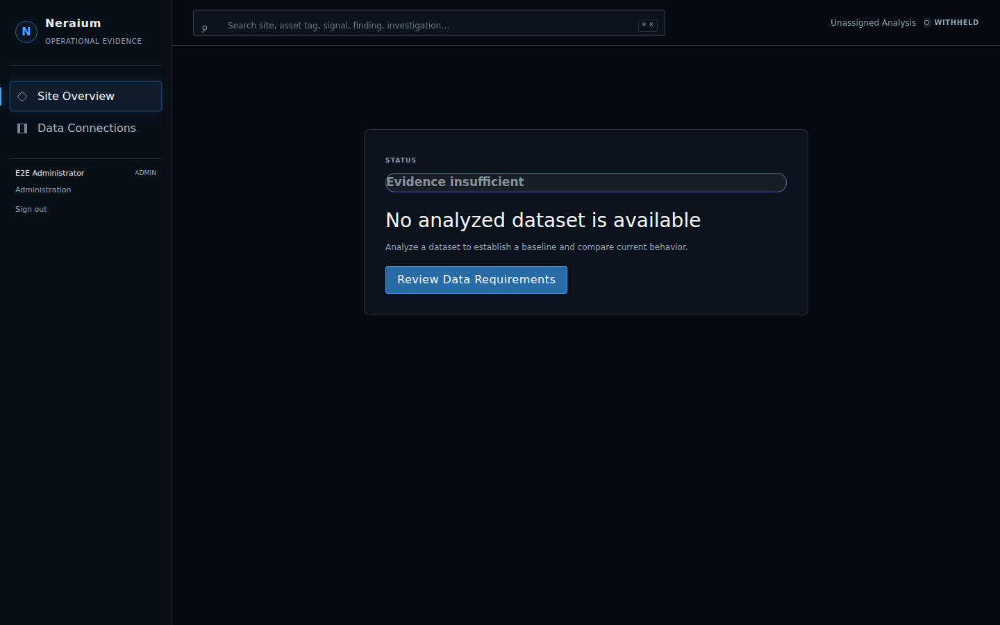
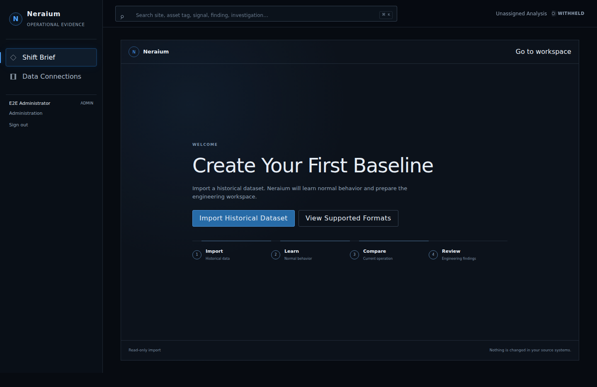
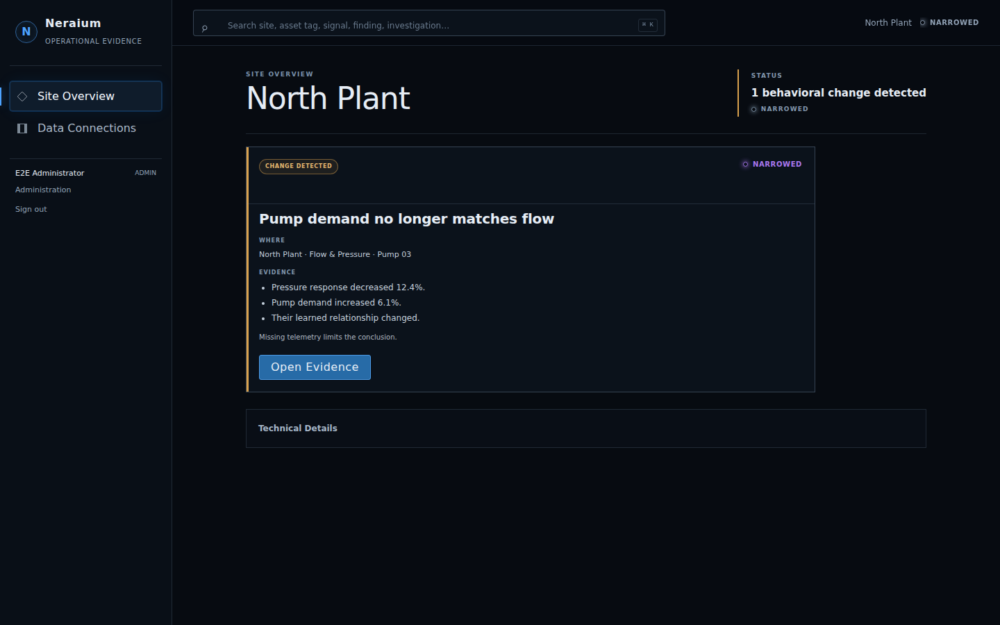
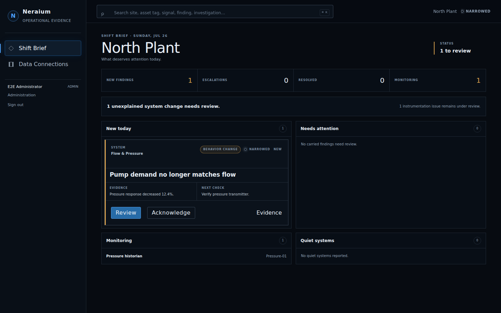
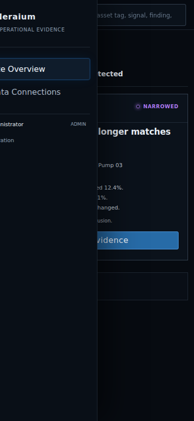
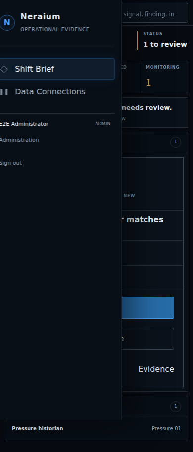

# Neraium UX refinement audit

## Scope

This refinement changes workflow, copy, responsive layout, and presentation only. It does not change SII execution, relationship scoring, finding classification, or infrastructure monitoring.

## Text density audit

| Surface | Before | After |
| --- | --- | --- |
| First authenticated screen | Analytical empty-state language before an analysis existed | First-baseline onboarding with one sentence, one primary action, and a four-step workflow |
| Baseline-needed workspace | “Evidence insufficient,” dataset explanation, and a documentation-oriented action | “Baseline Needed,” “No baseline available,” one evidence sentence, import action, optional formats |
| Site overview | Site status plus finding cards with location, three evidence bullets, and a limitation | Shift Brief with four counts, one calm answer, and operational sections |
| Finding card | Status, confidence, full location, affected areas, up to three evidence bullets, limitation, one action | System, headline, classification, confidence, status, one evidence sentence, one next check, Review/Acknowledge/Evidence |
| Evidence | Diagnostic values could compete with the finding summary | Why remains one click deeper; calculations, limitations, lineage, and trace remain collapsed under Technical Details |
| Dataset import | Repeated baseline explanation and always-visible supported-source chips | One short instruction; supported formats are disclosed on request |
| Mobile | 60 px header, 16 px side padding, empty sections ahead of the first action | 52 px header, compact icon, 10 px side padding, empty sections collapsed, first action visible |

## State language

| State | Status | Headline |
| --- | --- | --- |
| No dataset | Baseline Needed | No baseline available |
| Dataset ready | Dataset Ready | Ready to learn normal behavior |
| Analysis running | Analysis Running | Learning normal behavior |
| Analysis complete | Analysis Complete | Findings ready for review |
| No meaningful changes | Monitoring | No meaningful changes |
| Insufficient evidence | Insufficient Evidence | More evidence is needed |
| Legacy analysis | Legacy Analysis | Earlier analysis available |

“Evidence insufficient” is never used before an analysis output exists.

## Screens before and after

| Surface | Before | After |
| --- | --- | --- |
| No baseline, desktop |  |  |
| Shift brief, desktop |  |  |
| Shift brief, mobile |  |  |

## Workflow improvements

- First login without a baseline opens Create Your First Baseline automatically.
- Operators can exit setup and return to a non-analytical Baseline Needed workspace.
- The four-step workflow is Import, Learn, Compare, Review.
- Completed analysis opens a dedicated Shift Brief organized around New today, Needs attention, Monitoring, and Quiet systems.
- Morning counts show only New findings, Escalations, Resolved, and Monitoring.
- Acknowledgement is local presentation state and does not alter finding classification.
- Escalation language appears only when strong mode match, good data confidence, persistence, multiple relationships, criticality, and no known operational explanation are all explicit.

## Mobile improvements

- Replaced the text menu control with a compact icon at phone widths.
- Kept a flexible full-width search field with a 44 px menu target.
- Reduced the authenticated header to 52 px and main padding to 10 px.
- Collapsed empty shift sections on phones so the first finding action remains in the initial viewport.
- Compacted the import card and secondary workspace header while preserving touch targets and keyboard focus.

## Focused validation

- Frontend lint: passed with zero warnings.
- Frontend production build: passed.
- Focused component and view-model tests: 49 passed.
- Focused Playwright tests: 20 passed across shift workflow, mobile layout, accessibility, import progress, and upload completion.
- Full backend suite: not run, as requested.
